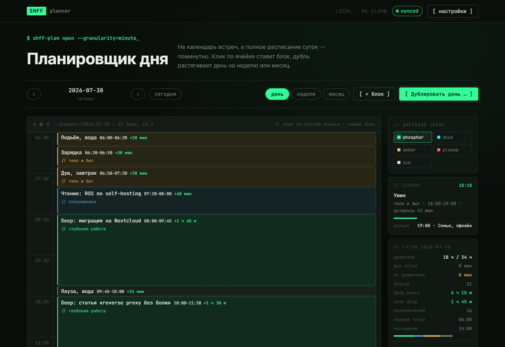
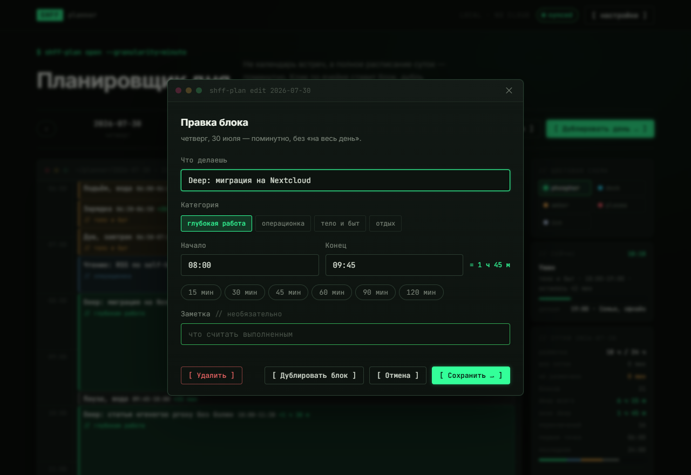
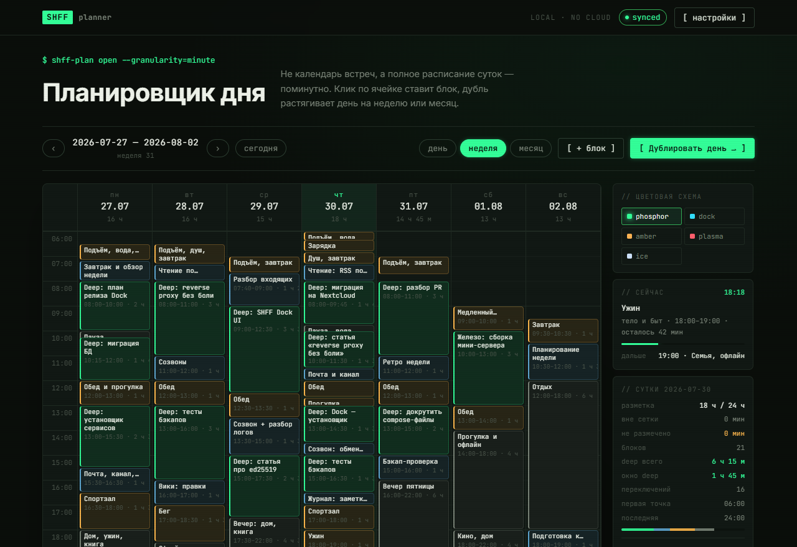
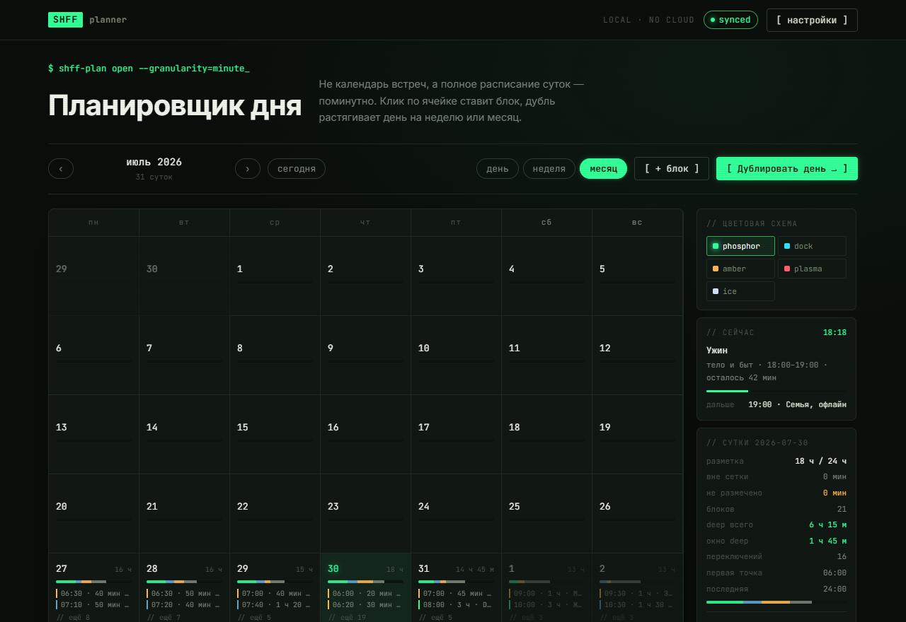
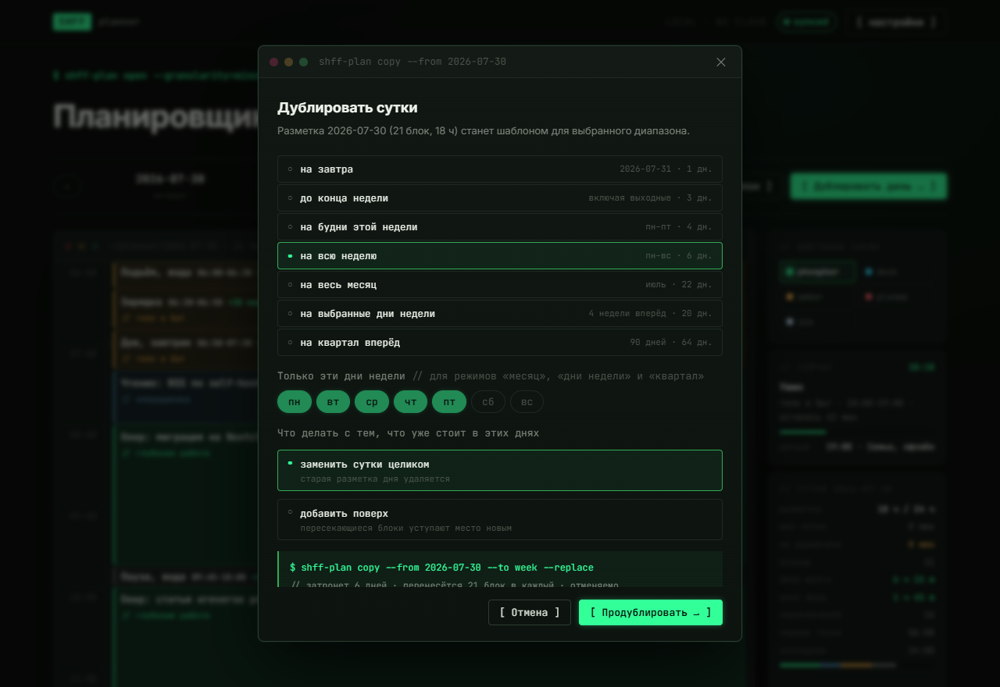
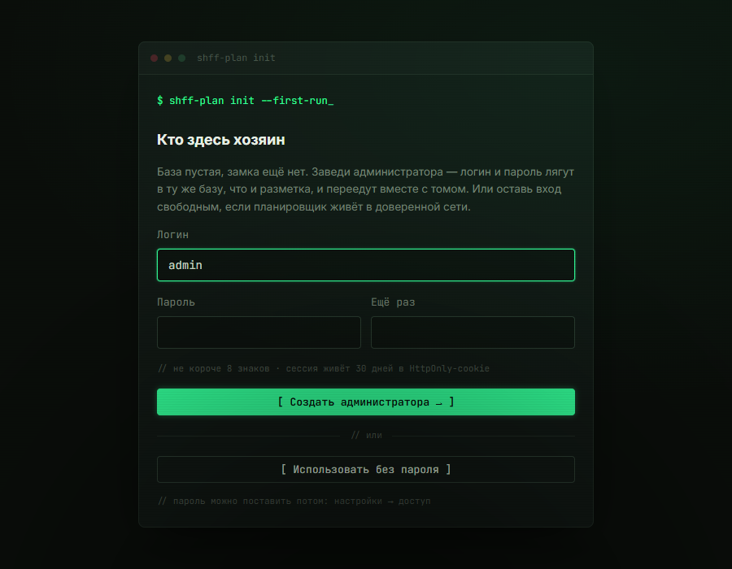
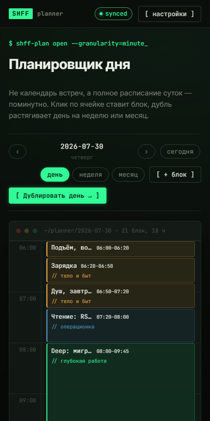
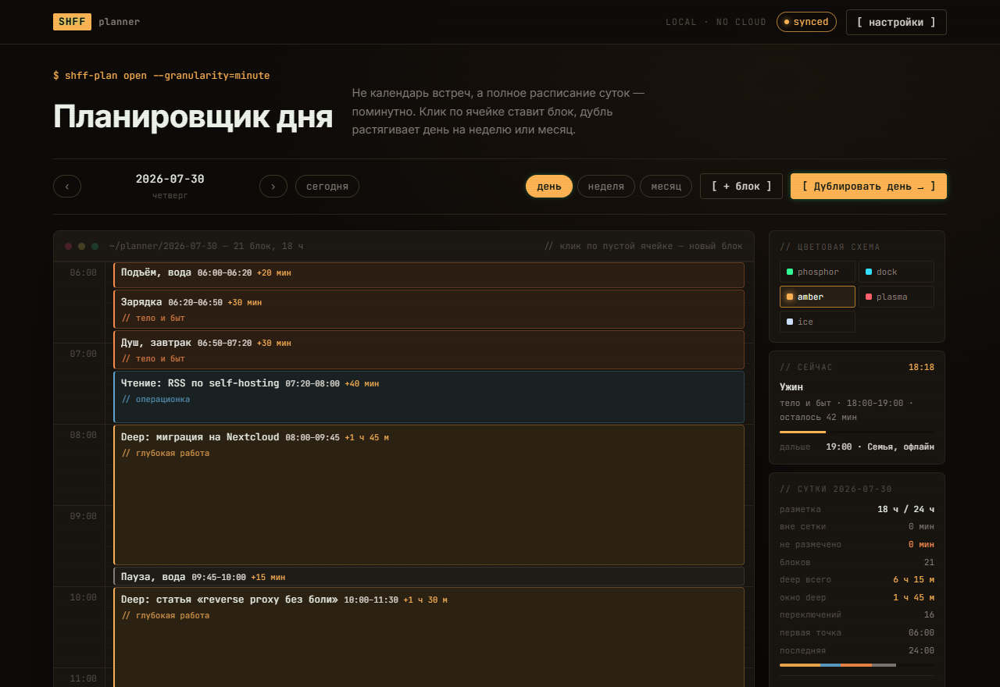
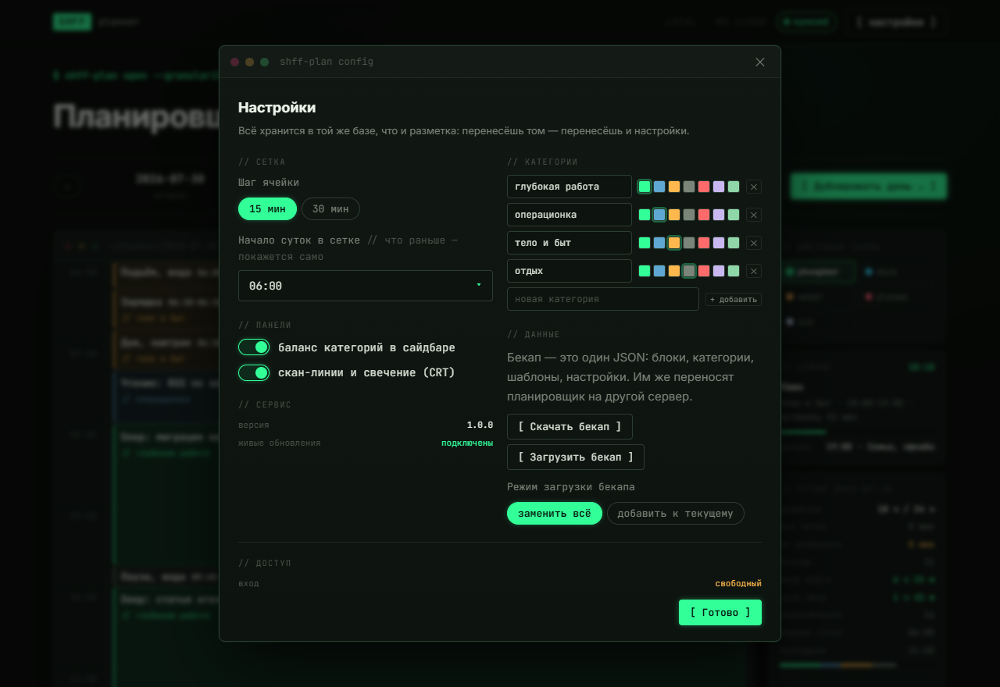

<div align="center">

# SHFF Planner

### Планировщик, который размечает сутки целиком — поминутно

Не список встреч, а честная картина дня: где работа, где еда, где отдых,<br>
а где дыра, в которую утекло три часа.

[](https://github.com/Heisenberg4441/shff-planner/actions/workflows/ci.yml)
[](https://hub.docker.com/r/heisenberg4441/shff-planner)
[](LICENSE)



**Живёт на твоём компьютере. Без облака, без аккаунтов в чужих сервисах, без аналитики.**

</div>

---

## Зачем он нужен

Обычный календарь показывает встречи. А день утекает **между** ними: полчаса на почту, час на «быстро
глянуть», вечер, который куда-то делся. Календарь про это ничего не скажет — там пусто, значит свободно.

Здесь наоборот. В сутках 1440 минут, и каждая либо чем-то занята, либо видна как **дыра в разметке**.
Планировщик считает: сколько ушло на глубокую работу, сколько на быт, сколько раз ты за день переключался
и какое у тебя было самое длинное окно без прерываний.

Смысл простой: **сначала решаешь, как пройдёт день, — потом живёшь его.** А не наоборот.

---

## Как это выглядит

### День — поминутно

Клик по пустой ячейке ставит блок. Красная линия — сейчас. Справа — что происходит прямо в эту
минуту, сколько осталось и что дальше.



Время можно набрать как удобно: `9`, `930`, `9:30`. Стрелками вверх-вниз — шагами по сетке.

### Неделя — семь суток рядом

Видно, где неделя провисает, а где забита под завязку. Клик по колонке открывает день, клик по часу —
сразу ставит блок в нужный день.



### Месяц — плотность одним взглядом

Цветная полоса под числом — из чего состояли сутки. Издалека видно, какие недели были рабочими,
а какие развалились.



---

## Что умеет

### Разметил один день — раскатал на месяц

Самое полезное. Обычный вторник настраивается один раз, а дальше уезжает на все будни, на весь месяц
или на квартал вперёд. Выбираешь дни недели, решаешь — заменить существующее или положить поверх.



Любую раскатку можно **отменить одной кнопкой** — даже если она затронула шестьдесят дней.

### Блоки не удаляют друг друга

Поставил пятнадцатиминутную паузу посреди четырёхчасовой работы — окно разделится на два,
а не исчезнет. Наехал на соседний блок — тот подрежется по краю. Планировщик заранее пишет,
что именно случится.

### Шаблоны суток

Три готовых («рабочий день», «глубокий фокус», «выходной») плюс возможность снять шаблон
с любого удачно размеченного дня и применять его дальше.

### Считает то, что обычно не считают

Сколько всего размечено · сколько не размечено · сколько ушло на каждую категорию ·
самое длинное окно без переключений · сколько раз за день менялся род занятий.

---

## Поставь за две минуты

Нужен только [Docker](https://docs.docker.com/get-started/get-docker/). Одна команда:

```bash
docker run -d --name shff-planner \
  -p 8787:8787 -v shff-planner-data:/data \
  --restart unless-stopped \
  heisenberg4441/shff-planner:latest
```

Открывай **http://localhost:8787** — планировщик спросит, кто здесь хозяин:

<div align="center">

</div>

Дома, в своей сети — смело жми «использовать без пароля». Если планировщик будет виден из интернета —
заведи логин и пароль. Передумать можно в любой момент: настройки → доступ.

<details>
<summary><b>Вариант через docker compose</b> (если хочешь править настройки файлом)</summary>

```bash
git clone https://github.com/Heisenberg4441/shff-planner.git
cd shff-planner
docker compose pull
docker compose up -d
```

Обновление потом: `docker compose pull && docker compose up -d`.

</details>

---

## С телефона тоже

<table>
<tr>
<td width="55%" valign="top">

Интерфейс складывается под узкий экран сам: сетка суток остаётся кликабельной, панели уезжают вниз.

Никакого приложения ставить не надо — это обычная страница в браузере. Открывается по адресу
твоего домашнего сервера, пока телефон в той же сети.

Всё, что ты поменял на телефоне, **мгновенно появляется на ноутбуке** — и наоборот. Планировщик
держит открытые вкладки в курсе сам, без обновления страницы.

</td>
<td width="45%">

</td>
</tr>
</table>

---

## Твои данные — твои

- **Ничего не уходит наружу.** Ни аналитики, ни счётчиков, ни шрифтов с чужих серверов —
  при загрузке страницы браузер не делает ни одного запроса в интернет. Это проверяется на каждой сборке.
- **Всё лежит в одном файле** базы внутри Docker-тома. Не в браузере, не в «облаке аккаунта».
- **Бекап — одна кнопка** в настройках: скачивается обычный JSON. Им же всё восстанавливается
  на другом сервере.
- **Работает без интернета.** Совсем. Хоть в самолёте, если сервер с тобой.

---

## Под себя

Пять цветовых схем, размер ячейки (15 или 30 минут), начало суток, свои категории с любыми
названиями и цветами.

<table>
<tr>
<td width="50%"></td>
<td width="50%"></td>
</tr>
<tr>
<td align="center"><i>тема amber — одна из пяти</i></td>
<td align="center"><i>настройки: сетка, категории, бекап, доступ</i></td>
</tr>
</table>

Горячие клавиши для тех, кто не любит мышь: <kbd>D</kbd> <kbd>W</kbd> <kbd>M</kbd> — вид,
<kbd>N</kbd> — новый блок, <kbd>C</kbd> — раскатать, <kbd>T</kbd> — сегодня,
<kbd>←</kbd> <kbd>→</kbd> — соседние дни.

---

## Короткие ответы

**Это бесплатно?** Да, MIT. Делай что хочешь, включая «поставить себе и никому не рассказывать».

**Нужен аккаунт?** Только локальный, который ты сам заводишь при первом запуске. Никакой регистрации
«у нас на сайте» не существует — сайта нет.

**А если я снесу контейнер?** Данные лежат в отдельном томе и переживают удаление контейнера,
обновление образа и переезд на другой сервер.

**Я не программист, у меня всё сломается.** Планировщик — это один контейнер и одна база. Если он
не поднялся, `docker logs shff-planner` покажет причину человеческим текстом.

**Можно поделиться планом с кем-то?** Нет, и это осознанно: планировщик рассчитан на одного человека.
Совместные календари прекрасно делают другие.

**Почему всё выглядит как терминал?** Потому что это часть семьи [SHFF](https://github.com/Heisenberg4441) —
проектов про домашние серверы и цифровую независимость. Зелёный люминофор здесь не декорация, а опознавательный знак.

---

## Для тех, кто копает глубже

Архитектура, API, переменные окружения, разработка, сборка и публикация образа —
**[docs/tech.md](docs/tech.md)**.

Если коротко: React + TypeScript на фронте, Node и SQLite на бэке, один Docker-образ, 89 тестов
и пайплайн, который не публикует образ, пока не поднимет его и не проверит по-настоящему.

---

<div align="center">

*Freedom can only live at home.*

</div>
